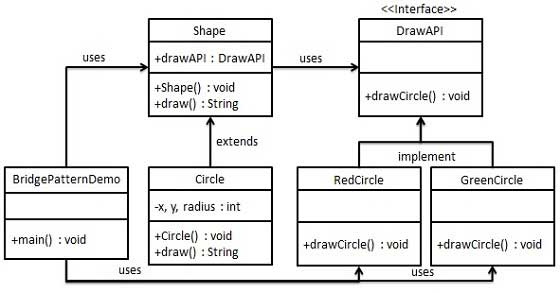
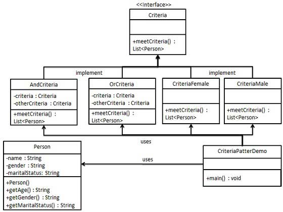
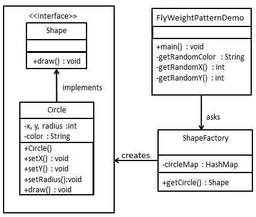

> 适配器模式(Adapter Pattern)是作为两个不兼容的接口之间的桥梁。这种类型的设计模式属于结构型模式，它结合了两个独立接口的功能

这种模式涉及到一个单一的类，该类负责加入独立的或不兼容的接口功能。举个真是的例子，读卡器是作为内存卡和笔记本之间的适配器。

适配器继承或依赖已有的对象，实现想要的目标接口

> 桥接(Bridge)是用于把抽象化与实现化解耦，使得二者可以独立变化

这种模式涉及到一个作为桥接的接口，使得实体类的功能独立于接口实现类。这两种类型的类可被结构化改变而互不影响。

抽象类依赖实现类

> 过滤器模式(Filter Pattern)或标准模式(Criteria Pattern)，这种模式允许开发人员使用不同的标准来过滤一组对象，通过逻辑运算以解耦的方式把它们连接起来

> 组合模式(Composite Pattern),又叫部分整体模式，适用于吧一组相似的对象当作一个单一的对象。组合模式依据树形结构来组合对象，用来表示部分以及整体层次

这种模式创建了一个包含自己对象组的类。该类提供了修改相同对象组的方式。

树枝内部组合该接口，并含有内部属性List，里面放Component

> 装饰器模式(Decorator Pattern)允许向一个现有的对象添加新的功能，同时又不改变其结构

这种模式创建了一个装饰类，用来包装原有的类，并在保持类方法签名完整性的前提下，提供了额外的功能

- Component类充当抽象角色，不应该具体实现
- 修饰类引用和继承Component类，具体扩展类重写父类方法

> 外观模式(Facade Pattern)隐藏系统的复杂性，并向客户端提供了一个客户端可以访问系统的接口

这种模式涉及到一个单一的类，该类提供了客户端请求的简化方法和对现有系统类方法的委托调用

在客户端和复杂系统之间再加一层，这一层将调用顺序、依赖关系等处理好

> 享元模式(Flyweight Pattern)主要用于减少创建对象的数量，以减少内存占用和提高性能

享元模式尝试重用现有的同类对象，如果未找到匹配的对象，则创建新对象。

用HashMap存储这些对象

> 在代理模式(Proxy Pattern)中，一个类代表另一个类的功能。

在代理模式中，我们创建具有现有对象的对象，以便向外界提供功能接口

实现与被代理类组合

